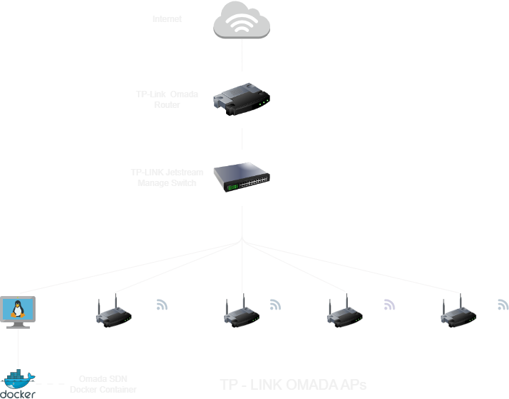

## Network Architecture
To ensure proper functionality of the Omada Controller Docker, it is essential to establish a connection between the host machine deploying the Omada Controller Container and the TP-Link JetStream Managed Switch or Router. This connection enables the Omada Controller to scan and detect Omada devices within the infrastructure.



## Getting Started

### Prerequisites

- Docker
- Docker Compose

### Setup

1. **Clone the repository:**

   ```sh
   git clone https://github.com/your-username/omada-sdn-deploy.git
   cd omada-sdn-deploy
   ```

2. **Create the .env file:**

   ```
   touch .env
   ```
Add the following content to the .env file

Replace 1000 with your actual user ID and group ID, which you can find by running id in your terminal.

   ```
    PUID=1000
    PGID=1000

   ```
3. **Update the docker-compose.yml file if necessary:**
The provided ```docker-compose.yml``` file is preconfigured, but you can adjust the ports and other settings as needed.

4. **Start the Omada Controller**
    ```
    docker-compose up -d --build

    ```

5. **Access the Omada Controller:**
    ```
    HTTP: http://localhost:8088
    HTTPS: https://localhost:8043

    ```

6. **Backing Up Data**
It's recommended to regularly back up the ```data```, ```logs```, and ```config ``` directories to prevent data loss.

7. You can watch a Full Omada COntroller Setup Based on the youtube link below:
- https://www.youtube.com/watch?v=e5lCHtagnHA&list=PLcBjWn4HjW4oDEH0Cu_K4rHmsohQuxOcN 
